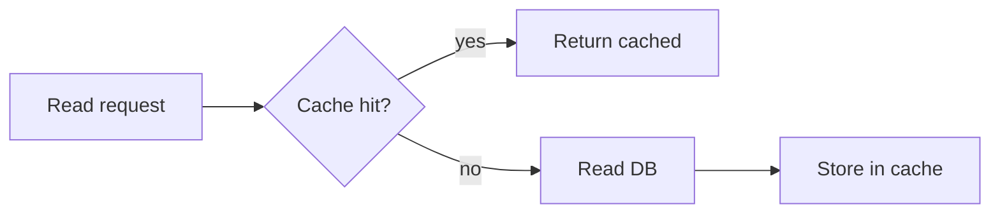

# Caching Strategies

## Why it matters
Strategy selection controls consistency, latency, and write amplification.

## Progression checkpoints
| Level | Focus |
| --- | --- |
| Beginner | Use cache-aside for reads. |
| Intermediate | Apply write-through and write-back. |
| Senior | Choose strategy per data type. |
| Principal | Define strategy defaults and exceptions. |

## Key concepts
- Cache-aside (lazy loading).
- Write-through vs write-back.
- TTL and refresh policies.

## Real-world example: User profiles
User reads use cache-aside; writes update DB first and invalidate cache.

## Diagram

## Practical checklist
- Use cache-aside for most read-heavy data.
- Document consistency expectations per strategy.
- Avoid write-back unless you can tolerate data loss.
