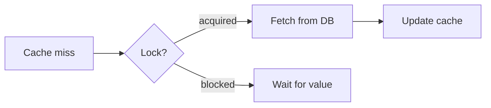

# Invalidation and Stampedes

## Why it matters
Cache invalidation is hard and stampedes can take services down.

## Progression checkpoints
| Level | Focus |
| --- | --- |
| Beginner | Use TTL and explicit invalidation. |
| Intermediate | Apply request coalescing. |
| Senior | Use soft TTL and refresh-ahead. |
| Principal | Define invalidation standards. |

## Key concepts
- Explicit invalidation vs TTL expiry.
- Cache stampedes and thundering herds.
- Request coalescing and locking.

## Detailed explanation
- **Explicit invalidation** provides freshness but increases complexity.
- **Stampedes** occur when many requests miss at once; coalescing mitigates.
- **Soft TTL** serves stale data while refreshing in the background.

## Real-world example: Flash sale pricing
Price changes trigger invalidation; a mutex prevents multiple DB reads per key.

## Diagram

## Additional real-world examples
- Jittered TTL prevents synchronized expiration during traffic spikes.
- Single-flight locking reduces duplicate DB reads for hot keys.
- Refresh-ahead job prewarms cache for popular items.

## Practical checklist
- Use jittered TTLs to avoid synchronized expiry.
- Coalesce concurrent misses for hot keys.
- Monitor miss rates during peak traffic.

## Official documentation
- https://www.rfc-editor.org/rfc/rfc5861
