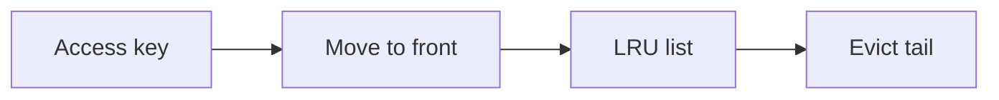

# Eviction Policies and Hot Data

## Why it matters
Caches have limited memory. Eviction policies decide what stays and what goes.

## Progression checkpoints
| Level | Focus |
| --- | --- |
| Beginner | Understand LRU and TTL. |
| Intermediate | Use LFU for repeated access. |
| Senior | Identify hot vs cold data. |
| Principal | Set policies by workload type. |

## Key concepts
- LRU, LFU, FIFO policies.
- Hot key detection and skew.
- Cache size and memory limits.

## Detailed explanation
- **LRU** works well for recency-based access, while **LFU** captures frequency.
- **Hot keys** can overload a single shard; detect and spread or replicate.
- **Memory limits** should leave headroom to avoid eviction storms.

## Real-world example: Session cache
Active sessions stay in cache while idle sessions are evicted.

## Diagram

## Additional real-world examples
- Popular product IDs cached in a dedicated hot-key tier.
- Cache memory limit increased after eviction storms during peak traffic.
- Sharded cache keys avoid single-node hotspots.

## Practical checklist
- Pick eviction based on access patterns.
- Monitor hit ratios and key distribution.
- Protect against hot-key overload.

## Official documentation
- https://redis.io/docs/latest/operate/oss_and_stack/management/eviction/
