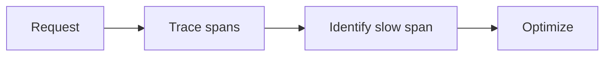

# Profiling and Bottlenecks

## Why it matters
Performance tuning without profiling wastes time. Measurements guide fixes.

## Progression checkpoints
| Level | Focus |
| --- | --- |
| Beginner | Measure latency and throughput. |
| Intermediate | Use tracing to find slow spans. |
| Senior | Profile CPU and memory hotspots. |
| Principal | Set performance targets and reviews. |

## Key concepts
- Application profiling (CPU, memory).
- Distributed tracing and spans.
- Tail latency and p99 analysis.

## Detailed explanation
- **Profilers** reveal CPU and memory hotspots that metrics alone miss.
- **Tracing** identifies slow external dependencies and internal stages.
- **Tail latency** often indicates contention, GC pauses, or retries.

## Real-world example: Slow checkout
Tracing shows payment calls dominate latency; caching and connection pooling
reduce response time.

## Diagram

## Additional real-world examples
- CPU profile shows JSON serialization dominating response time.
- Tracing reveals a downstream cache miss causing p99 spikes.
- Memory profile identifies a large in-memory buffer leak.

## Practical checklist
- Measure before and after changes.
- Focus on p95 and p99 latency.
- Re-test under realistic load.

## Official documentation
- https://go.dev/doc/diagnostics
- https://opentelemetry.io/docs/
