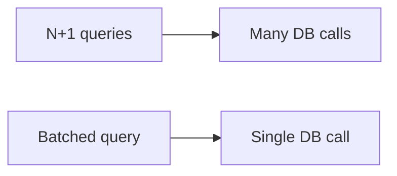

# Database Performance Patterns

## Why it matters
Databases are often the bottleneck. Query patterns determine latency and cost.

## Progression checkpoints
| Level | Focus |
| --- | --- |
| Beginner | Avoid obvious N+1 queries. |
| Intermediate | Use indexes and batching. |
| Senior | Analyze query plans and tune schema. |
| Principal | Define DB performance standards. |

## Key concepts
- N+1 query pattern and batching.
- Indexing and covering indexes.
- Query plan analysis.

## Detailed explanation
- **Batching** reduces round trips for related data.
- **Covering indexes** avoid extra table lookups for hot queries.
- **Query plans** show scans vs index usage and guide optimizations.

## Real-world example: Order list
Instead of loading items per order, fetch all items in a single query.

## Diagram

## Additional real-world examples
- Aggregation query sped up by adding a composite index.
- Missing index on foreign key caused a full scan on a join.
- Read replica used for analytics to avoid impacting OLTP traffic.

## Practical checklist
- Use batch queries for related data.
- Index columns used in WHERE/ORDER BY.
- Review slow query logs regularly.

## Official documentation
- https://www.postgresql.org/docs/current/indexes.html
- https://dev.mysql.com/doc/refman/8.0/en/optimization.html
