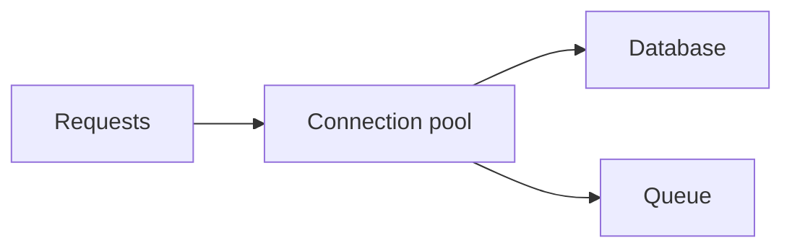

# Connection Pooling and Limits

## Why it matters
Unbounded connections can overload databases and cause cascading failures.

## Progression checkpoints
| Level | Focus |
| --- | --- |
| Beginner | Use a connection pool. |
| Intermediate | Tune pool sizes for workload. |
| Senior | Apply backpressure and timeouts. |
| Principal | Define connection policies across services. |

## Key concepts
- Pool size and queue limits.
- Connection timeouts and retries.
- Backpressure and load shedding.

## Detailed explanation
- **Pool sizing** should align with DB max connections and workload patterns.
- **Queue limits** prevent unbounded waits that increase tail latency.
- **Backpressure** sheds load early to protect core systems.

## Real-world example: API spike
A sudden traffic spike exhausts DB connections. Pool limits prevent overload
and shed excess traffic.

## Diagram

## Additional real-world examples
- Pool size reduced after observing DB CPU saturation during spikes.
- Requests rejected quickly when pool is full to keep latency predictable.
- Read replicas use separate pools to isolate analytics traffic.

## Practical checklist
- Set max connections per service.
- Use timeouts for pool acquisition.
- Monitor pool saturation and queue depth.

## Official documentation
- https://www.postgresql.org/docs/current/runtime-config-connection.html
- https://www.pgbouncer.org/usage.html
