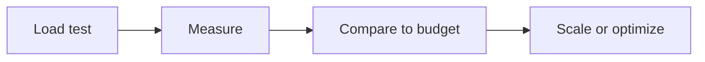

# Load Testing and Budgets

## Why it matters
Load tests reveal bottlenecks before users do. Performance budgets keep teams
aligned on expectations.

## Progression checkpoints
| Level | Focus |
| --- | --- |
| Beginner | Run basic load tests. |
| Intermediate | Define latency targets. |
| Senior | Model capacity and scaling. |
| Principal | Establish performance budgets org-wide. |

## Key concepts
- Load, stress, and soak testing.
- p95 and p99 latency targets.
- Capacity planning and scaling triggers.

## Detailed explanation
- **Load tests** validate expected traffic; **stress tests** find breaking
  points; **soak tests** reveal memory leaks.
- **Latency targets** should be defined per endpoint and user journey.
- **Scaling triggers** need to be backed by measurements, not guesses.

## Real-world example: Checkout SLA
The team targets p95 < 200 ms at 500 RPS and scales when CPU exceeds 70%.

## Diagram

## Additional real-world examples
- Soak test reveals memory growth over 24 hours under steady load.
- Load tests include realistic payload sizes and cache warm-up phases.
- Performance budget gates releases in CI/CD.

## Practical checklist
- Test with realistic data and traffic shape.
- Document targets and rollback criteria.
- Re-run tests after major changes.

## Official documentation
- https://grafana.com/docs/k6/latest/
- https://jmeter.apache.org/usermanual/
