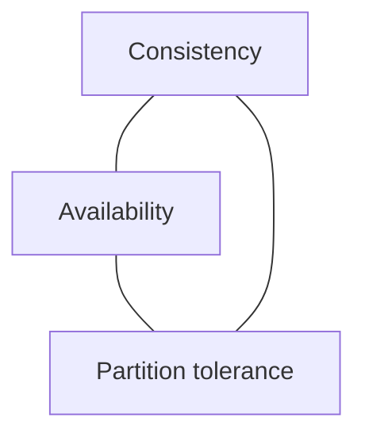

# CAP and Consistency Models

## Why it matters
Distributed systems must choose tradeoffs between consistency and availability
under network partitions.

## Progression checkpoints
| Level | Focus |
| --- | --- |
| Beginner | Understand CAP basics. |
| Intermediate | Choose consistency models. |
| Senior | Align models with product needs. |
| Principal | Define consistency standards. |

## Key concepts
- CAP theorem and partitions.
- Strong vs eventual consistency.
- Read-your-writes and monotonic reads.

## Real-world example: Shopping cart
Cart reads can be eventually consistent, but checkout requires strong
consistency.

## Diagram

## Practical checklist
- Document which flows require strong consistency.
- Communicate consistency guarantees to clients.
- Use eventual consistency for non-critical reads.
