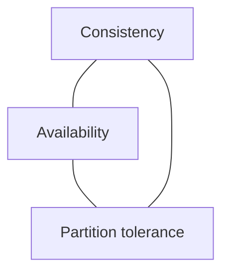

# CAP and Consistency Models

## Why it matters
Distributed systems must choose tradeoffs between consistency and availability
under network partitions.

## Progression checkpoints
| Level | Focus |
| --- | --- |
| Beginner | Understand CAP basics. |
| Intermediate | Choose consistency models. |
| Senior | Align models with product needs. |
| Principal | Define consistency standards. |

## Key concepts
- CAP theorem and partitions.
- Strong vs eventual consistency.
- Read-your-writes and monotonic reads.

## Detailed explanation
- **CAP** highlights tradeoffs under partitions; you still decide latency and
  correctness tradeoffs in normal operation.
- **Strong consistency** simplifies reasoning; **eventual consistency** improves
  availability and write throughput.
- **Session guarantees** (read-your-writes, monotonic reads) improve UX without
  full global consistency.

## Real-world example: Shopping cart
Cart reads can be eventually consistent, but checkout requires strong
consistency.

## Diagram

## Additional real-world examples
- Social feeds accept eventual consistency for timelines.
- Checkout inventory uses strong consistency to prevent oversells.
- User profile edits use session consistency to show immediate updates.

## Practical checklist
- Document which flows require strong consistency.
- Communicate consistency guarantees to clients.
- Use eventual consistency for non-critical reads.

## Official documentation
- https://cloud.google.com/spanner/docs/true-time-external-consistency
- https://docs.aws.amazon.com/amazondynamodb/latest/developerguide/HowItWorks.ReadConsistency.html
