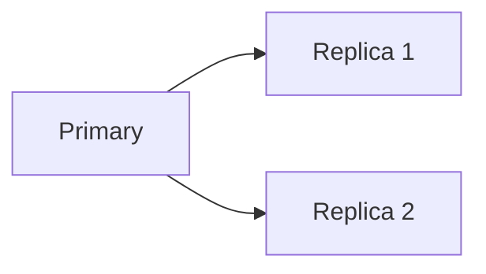

# Replication and Leader Election

## Why it matters
Replication improves availability and read scalability but introduces lag and
consistency challenges.

## Progression checkpoints
| Level | Focus |
| --- | --- |
| Beginner | Understand leader/follower replication. |
| Intermediate | Handle replica lag and failover. |
| Senior | Design leader election and health checks. |
| Principal | Define replication topologies and SLAs. |

## Key concepts
- Leader/follower replication.
- Synchronous vs asynchronous replication.
- Replica lag and failover.

## Real-world example: Read scaling
An API writes to a primary database and reads from replicas for reporting.

## Diagram

## Practical checklist
- Monitor replication lag.
- Define failover and promotion procedures.
- Route critical reads to the leader.
