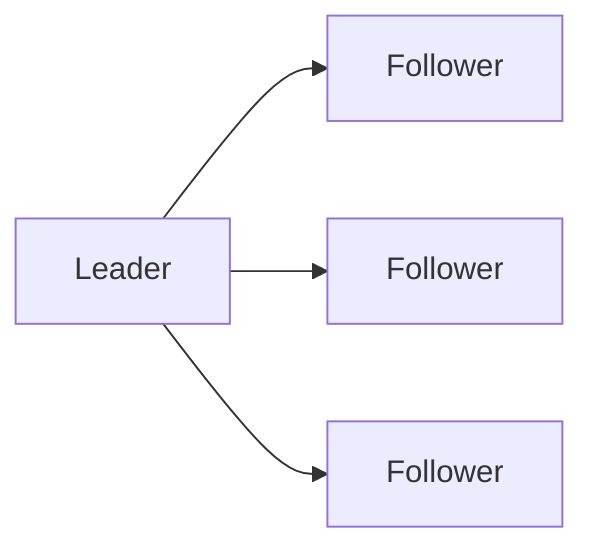

# Consensus Basics

## Why it matters
Consensus keeps distributed systems consistent during failures.

## Progression checkpoints
| Level | Focus |
| --- | --- |
| Beginner | Understand quorum and majority. |
| Intermediate | Learn Raft/Paxos concepts. |
| Senior | Apply consensus for config and coordination. |
| Principal | Decide when consensus is required. |

## Key concepts
- Quorum reads and writes.
- Leader election and log replication.
- Raft/Paxos fundamentals.

## Real-world example: Config service
A configuration store uses consensus to ensure every node has the same config.

## Diagram

## Practical checklist
- Use consensus only where correctness demands it.
- Monitor quorum health.
- Plan for leader failover.
