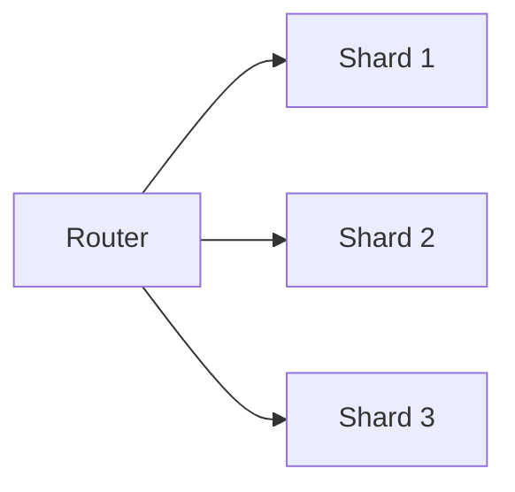

# Sharding and Partitioning

## Why it matters
Partitioning spreads load across machines but adds routing complexity.

## Progression checkpoints
| Level | Focus |
| --- | --- |
| Beginner | Understand shard keys. |
| Intermediate | Avoid hot partitions. |
| Senior | Plan resharding and migration. |
| Principal | Define sharding strategy and governance. |

## Key concepts
- Range vs hash partitioning.
- Hot keys and uneven load.
- Resharding and data migration.

## Real-world example: User sharding
Users are sharded by user_id to balance load across nodes.

## Diagram

## Practical checklist
- Choose shard keys with uniform distribution.
- Plan for resharding early.
- Keep routing logic simple.
