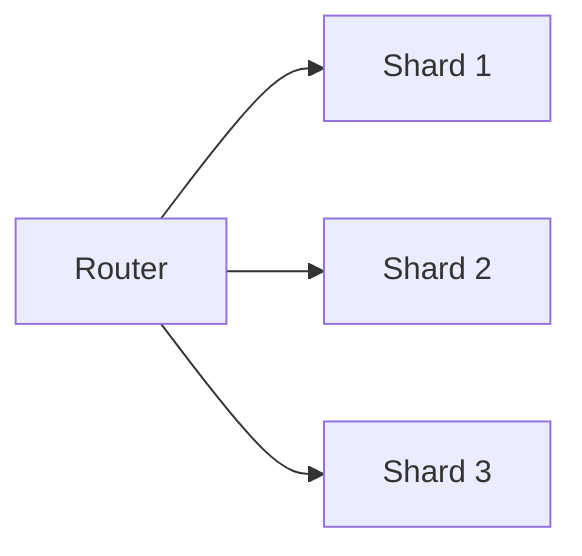

# Sharding and Partitioning

## Why it matters
Partitioning spreads load across machines but adds routing complexity.

## Progression checkpoints
| Level | Focus |
| --- | --- |
| Beginner | Understand shard keys. |
| Intermediate | Avoid hot partitions. |
| Senior | Plan resharding and migration. |
| Principal | Define sharding strategy and governance. |

## Key concepts
- Range vs hash partitioning.
- Hot keys and uneven load.
- Resharding and data migration.

## Detailed explanation
- **Range partitioning** enables ordered queries but risks hot spots.
- **Hash partitioning** balances load but makes range scans harder.
- **Resharding** requires careful migration and dual writes to avoid downtime.

## Real-world example: User sharding
Users are sharded by user_id to balance load across nodes.

## Diagram

## Additional real-world examples
- Time-based range shards cause hot partitions during peak hours.
- Hashing user IDs distributes load evenly across shards.
- Dual-write migration used during shard split to avoid data loss.

## Practical checklist
- Choose shard keys with uniform distribution.
- Plan for resharding early.
- Keep routing logic simple.

## Official documentation
- https://www.mongodb.com/docs/manual/sharding/
- https://cassandra.apache.org/doc/latest/cassandra/architecture/dynamo.html
