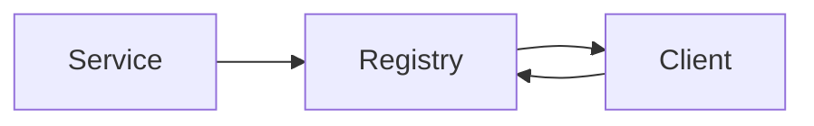

# Service Discovery

## Why it matters
Dynamic environments need reliable service discovery to route traffic.

## Progression checkpoints
| Level | Focus |
| --- | --- |
| Beginner | Know DNS-based discovery. |
| Intermediate | Use registries and health checks. |
| Senior | Handle client-side vs server-side discovery. |
| Principal | Standardize discovery and routing. |

## Key concepts
- DNS-based discovery.
- Service registries.
- Health checks and TTLs.
- Client-side vs server-side discovery.

## Real-world example: Microservice fleet
Services register with a registry; clients resolve healthy instances.

## Diagram

## Practical checklist
- Keep health checks lightweight.
- Avoid stale entries with TTLs.
- Document discovery ownership.
