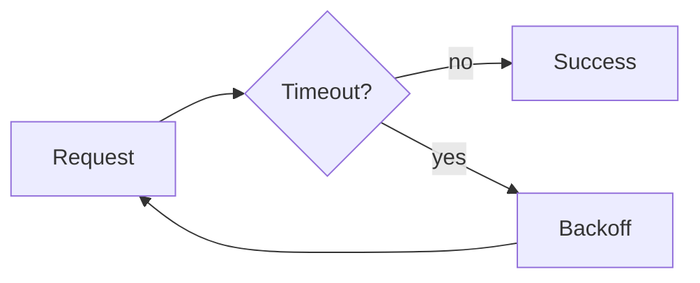

# Retries, Timeouts, and Idempotency

## Why it matters
Retries can recover transient failures but can also amplify outages.

## Progression checkpoints
| Level | Focus |
| --- | --- |
| Beginner | Set timeouts for network calls. |
| Intermediate | Use exponential backoff. |
| Senior | Define idempotent operations. |
| Principal | Standardize retry policies. |

## Key concepts
- Timeouts and retry budgets.
- Exponential backoff with jitter.
- Idempotency keys and safe retries.

## Real-world example: Inventory API
Clients retry a reservation request with an idempotency key to avoid duplicates.

## Diagram

## Practical checklist
- Keep total retry time bounded.
- Use idempotency for retried writes.
- Monitor retry rates and error spikes.
