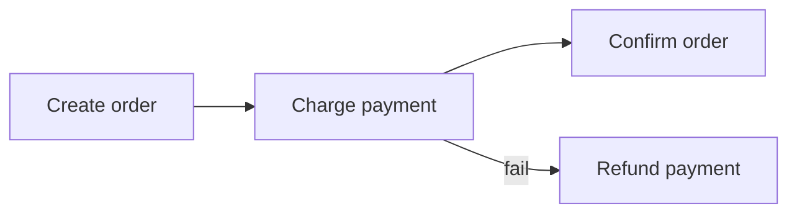

# Distributed Transactions and Sagas

## Why it matters
Cross-service updates need coordination without global locks.

## Progression checkpoints
| Level | Focus |
| --- | --- |
| Beginner | Understand distributed transaction challenges. |
| Intermediate | Use saga patterns. |
| Senior | Design compensation actions. |
| Principal | Set consistency expectations across services. |

## Key concepts
- Two-phase commit (2PC) limitations.
- Sagas and compensating actions.
- Outbox pattern for event delivery.

## Real-world example: Order and payment
An order is created, payment is charged, and a compensation refunds on failure.

## Diagram

## Practical checklist
- Design compensating actions for each step.
- Keep saga steps small and idempotent.
- Monitor saga failures and retries.
