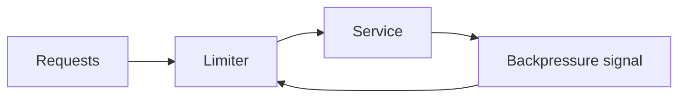

# Rate Limiting and Backpressure

## Why it matters
Backpressure prevents upstream systems from overwhelming downstream services.

## Progression checkpoints
| Level | Focus |
| --- | --- |
| Beginner | Use simple rate limits. |
| Intermediate | Apply backpressure in queues. |
| Senior | Use adaptive throttling. |
| Principal | Define global rate limit policies. |

## Key concepts
- Token buckets and rate limits.
- Queue backpressure and shedding.
- Adaptive throttling based on load.

## Real-world example: Search service
When latency spikes, the gateway reduces request rate for non-critical clients.

## Diagram

## Practical checklist
- Apply limits at the edge and service level.
- Shed low-priority traffic first.
- Monitor saturation and latency.
