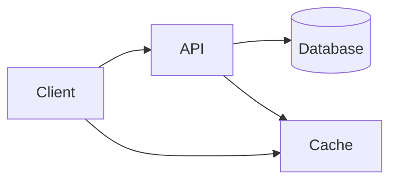

# Design Tradeoffs and Case Studies

## Why it matters
System design is about tradeoffs. Practice builds intuition and leadership.

## Progression checkpoints
| Level | Focus |
| --- | --- |
| Beginner | Design small systems with clear requirements. |
| Intermediate | Evaluate tradeoffs for scaling. |
| Senior | Plan for failures and cost. |
| Principal | Lead design reviews and align stakeholders. |

## Key concepts
- Requirements and constraints.
- Scalability vs consistency vs cost.
- Failure modes and mitigation.

## Real-world example: URL shortener
Design a short URL service with a write-heavy path and read-heavy redirects.

## Diagram

## Practical checklist
- Document assumptions and constraints.
- Identify bottlenecks early.
- Provide alternatives with pros/cons.
