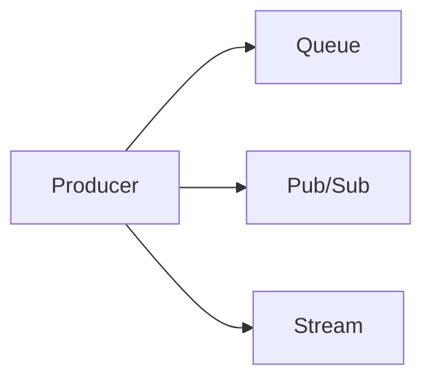

# Messaging Models

## Why it matters
The messaging model determines how data flows and how consumers scale.

## Progression checkpoints
| Level | Focus |
| --- | --- |
| Beginner | Distinguish queue vs pub/sub vs stream. |
| Intermediate | Match model to use case. |
| Senior | Combine models safely. |
| Principal | Standardize platform choices. |

## Key concepts
- Queues for point-to-point work.
- Pub/sub for fan-out.
- Streams for ordered, replayable events.

## Real-world example: Order events
Orders are streamed for analytics, while fulfillment jobs use a queue.

## Diagram

## Practical checklist
- Use queues for work distribution.
- Use streams when replay is required.
- Avoid mixing models without clear boundaries.
