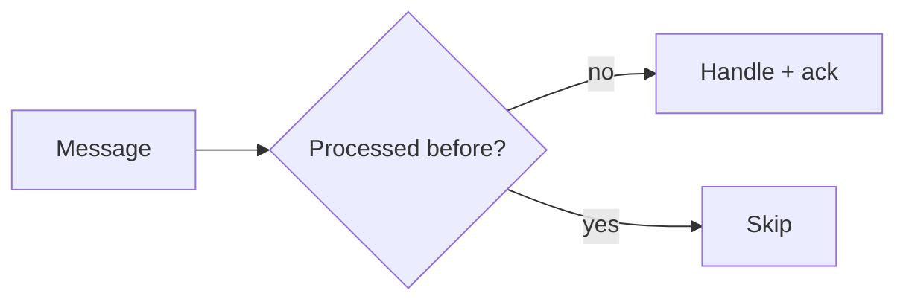

# Delivery Semantics

## Why it matters
Delivery semantics affect correctness and consumer logic.

## Progression checkpoints
| Level | Focus |
| --- | --- |
| Beginner | Understand at-most-once and at-least-once. |
| Intermediate | Implement idempotent consumers. |
| Senior | Handle duplicates and replays. |
| Principal | Define platform guarantees. |

## Key concepts
- At-most-once, at-least-once, exactly-once.
- Idempotent processing.
- Acknowledgements and retries.

## Real-world example: Payment events
Consumers dedupe events using a unique event ID to avoid double processing.

## Diagram

## Practical checklist
- Design consumers to be idempotent.
- Track event IDs for deduplication.
- Understand your broker guarantees.
