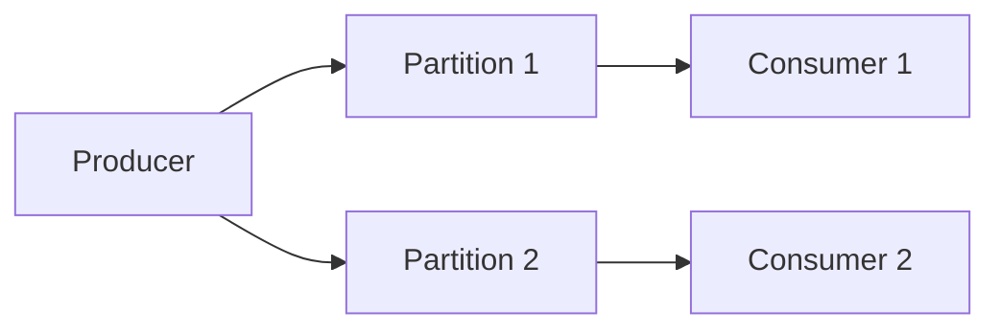

# Ordering and Partitioning

## Why it matters
Ordering guarantees are often required for correctness but limit throughput.

## Progression checkpoints
| Level | Focus |
| --- | --- |
| Beginner | Understand ordering guarantees. |
| Intermediate | Use partition keys. |
| Senior | Balance ordering with parallelism. |
| Principal | Define ordering policies per domain. |

## Key concepts
- Partitioning and ordered streams.
- Key-based ordering.
- Rebalance and hot partitions.

## Real-world example: User activity stream
Events are partitioned by user_id to keep per-user ordering.

## Diagram

## Practical checklist
- Choose partition keys to avoid hot spots.
- Document ordering requirements per event.
- Plan for rebalances and replays.
