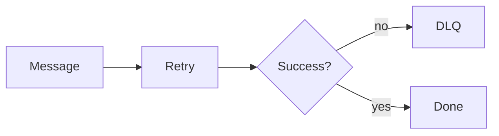

# Retries and Dead Letter Queues

## Why it matters
Retries handle transient failures. DLQs isolate poison messages.

## Progression checkpoints
| Level | Focus |
| --- | --- |
| Beginner | Configure retries. |
| Intermediate | Use DLQs for failed messages. |
| Senior | Triage and replay safely. |
| Principal | Define retry and DLQ policies. |

## Key concepts
- Retry policies and backoff.
- Dead letter queues and reprocessing.
- Poison message handling.

## Real-world example: Email sends
Failed email sends retry three times then move to a DLQ for manual review.

## Diagram

## Practical checklist
- Cap retry attempts and duration.
- Alert on DLQ growth.
- Provide replay tooling.
