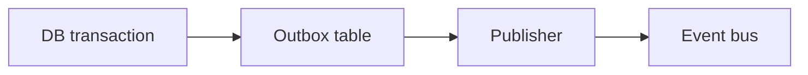

# Outbox and Inbox Patterns

## Why it matters
Outbox and inbox patterns ensure reliable event delivery between services.

## Progression checkpoints
| Level | Focus |
| --- | --- |
| Beginner | Understand outbox basics. |
| Intermediate | Implement inbox deduplication. |
| Senior | Handle delivery guarantees end-to-end. |
| Principal | Standardize patterns across services. |

## Key concepts
- Transactional outbox for reliable publishing.
- Inbox for idempotent consumption.
- Exactly-once behavior through dedupe.

## Real-world example: Order created events
Order creation writes to the DB and outbox in the same transaction.

## Diagram

## Practical checklist
- Publish events from the outbox asynchronously.
- Deduplicate messages on the consumer side.
- Monitor outbox lag.
