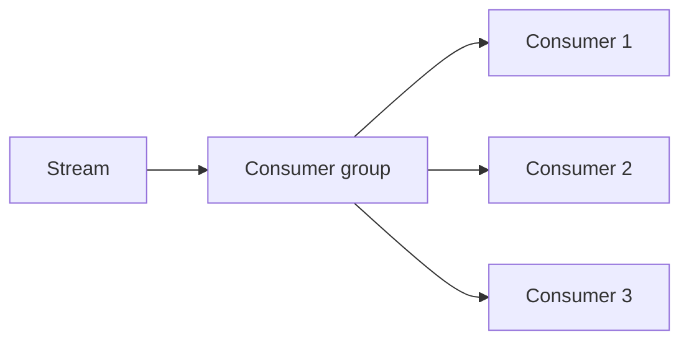

# Consumer Scaling and Backpressure

## Why it matters
Consumers must scale with load while avoiding overload and message loss.

## Progression checkpoints
| Level | Focus |
| --- | --- |
| Beginner | Scale consumers horizontally. |
| Intermediate | Use backpressure signals. |
| Senior | Tune partitions and batch sizes. |
| Principal | Define scaling policies and autoscaling rules. |

## Key concepts
- Consumer groups and partition assignment.
- Backpressure and flow control.
- Batch size, commit frequency, and lag.

## Real-world example: Order processing
During peak traffic, consumer count doubles and batch sizes shrink to keep
latency stable.

## Diagram

## Practical checklist
- Monitor consumer lag and throughput.
- Scale consumers based on lag thresholds.
- Apply backpressure when downstream slows.
