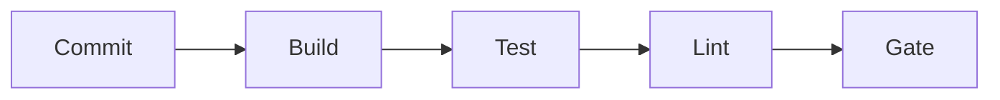

# CI Pipelines

## Why it matters
CI ensures code is validated on every change, reducing regressions.

## Progression checkpoints
| Level | Focus |
| --- | --- |
| Beginner | Run tests and lint on commits. |
| Intermediate | Add quality gates and artifacts. |
| Senior | Optimize pipeline speed and caching. |
| Principal | Define CI standards and policies. |

## Key concepts
- Build, test, and lint stages.
- Quality gates and required checks.
- Build caching and parallelism.

## Real-world example: Service CI
Every PR runs unit tests and linting before merge.

## Diagram

## Practical checklist
- Fail fast on lint or test errors.
- Keep pipelines under 10 minutes.
- Require CI checks for merge.
