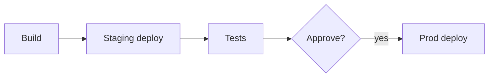

# CD Pipelines and Approvals

## Why it matters
CD pipelines deliver changes safely and consistently.

## Progression checkpoints
| Level | Focus |
| --- | --- |
| Beginner | Deploy to staging automatically. |
| Intermediate | Add approval gates for prod. |
| Senior | Automate rollbacks and verifications. |
| Principal | Define release governance. |

## Key concepts
- Promotion from staging to production.
- Manual approvals and automated checks.
- Rollback strategies.

## Real-world example: Production release
After staging tests pass, a release requires a manual approval to deploy to
production.

## Diagram

## Practical checklist
- Require approvals for high-risk changes.
- Automate rollback when checks fail.
- Keep deployment history auditable.
