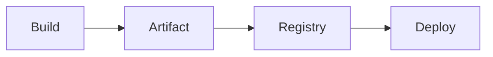

# Artifacts and Versioning

## Why it matters
Versioned artifacts enable reproducible deployments and rollback.

## Progression checkpoints
| Level | Focus |
| --- | --- |
| Beginner | Tag builds with versions. |
| Intermediate | Store artifacts in a registry. |
| Senior | Automate versioning and release notes. |
| Principal | Define org-wide versioning policies. |

## Key concepts
- Semantic versioning.
- Artifact repositories and retention.
- Build metadata and provenance.

## Real-world example: Service release
Each build produces a versioned container image stored in a registry.

## Diagram

## Practical checklist
- Use immutable artifacts.
- Store metadata for traceability.
- Keep retention policies documented.
