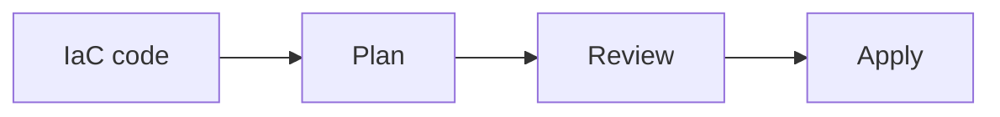

# Infrastructure as Code

## Why it matters
IaC provides repeatable, auditable infrastructure changes.

## Progression checkpoints
| Level | Focus |
| --- | --- |
| Beginner | Understand declarative infrastructure. |
| Intermediate | Use modules and environments. |
| Senior | Apply change reviews and drift detection. |
| Principal | Define IaC standards and policies. |

## Key concepts
- Declarative vs imperative IaC.
- State management and locking.
- Drift detection and change plans.

## Real-world example: VPC provisioning
Networking is defined in code and reviewed via pull requests.

## Diagram

## Practical checklist
- Require reviews for infra changes.
- Lock state to avoid conflicts.
- Detect and correct drift regularly.
