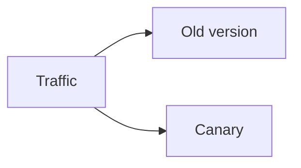

# Deployment Strategies

## Why it matters
Deployment strategy determines risk and rollback speed.

## Progression checkpoints
| Level | Focus |
| --- | --- |
| Beginner | Understand rolling deployments. |
| Intermediate | Use blue/green and canary. |
| Senior | Automate health checks and rollbacks. |
| Principal | Define org-wide deployment policies. |

## Key concepts
- Rolling updates.
- Blue/green deployments.
- Canary releases and progressive delivery.

## Real-world example: Canary rollout
5% of traffic is routed to the new version; if metrics are stable, rollout
continues.

## Diagram

## Practical checklist
- Define success metrics before rollout.
- Automate rollback on SLO breaches.
- Document deployment steps and owners.
