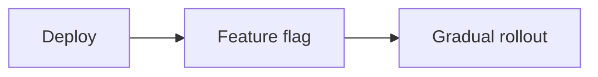

# Feature Flags and Release Management

## Why it matters
Feature flags reduce risk by decoupling deploy from release.

## Progression checkpoints
| Level | Focus |
| --- | --- |
| Beginner | Use flags to toggle features. |
| Intermediate | Roll out to cohorts. |
| Senior | Automate flag cleanup and governance. |
| Principal | Define release management standards. |

## Key concepts
- Kill switches and safe defaults.
- Gradual rollout and cohorts.
- Flag lifecycle and cleanup.

## Real-world example: New checkout flow
A new checkout is enabled for 5% of users and rolled out after metrics hold.

## Diagram

## Practical checklist
- Always include a kill switch.
- Remove stale flags regularly.
- Track flag usage and impact.
