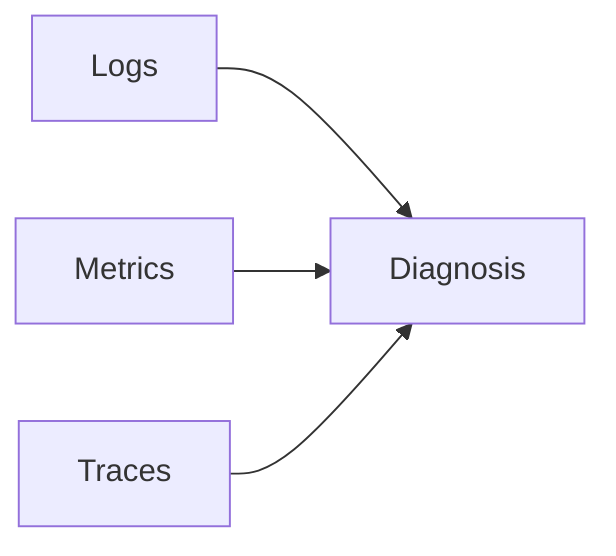

# Logs, Metrics, Traces

## Why it matters
The three pillars provide different views of system behavior. Together they
enable fast diagnosis and trend analysis.

## Progression checkpoints
| Level | Focus |
| --- | --- |
| Beginner | Know the purpose of each pillar. |
| Intermediate | Correlate logs with metrics. |
| Senior | Use traces to find bottlenecks. |
| Principal | Define observability standards. |

## Key concepts
- Logs: discrete events with context.
- Metrics: time series for trends.
- Traces: end-to-end request paths.

## Real-world example: API latency spikes
Metrics show p99 latency spikes, traces identify a slow dependency, logs show
error details.

## Diagram

## Practical checklist
- Always capture request IDs.
- Use metrics for alerting and logs for details.
- Trace critical user flows end-to-end.
