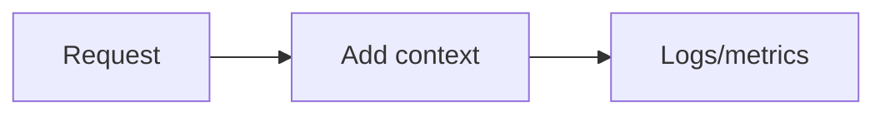

# Instrumentation and Context

## Why it matters
Instrumentation adds the context needed to debug production issues quickly.

## Progression checkpoints
| Level | Focus |
| --- | --- |
| Beginner | Add basic logs and metrics. |
| Intermediate | Use structured logs and tags. |
| Senior | Standardize context propagation. |
| Principal | Define instrumentation guidelines. |

## Key concepts
- Structured logging fields.
- Metric labels and cardinality.
- Context propagation (request IDs).

## Real-world example: Checkout metrics
The checkout service tags metrics with region and payment provider.

## Diagram

## Practical checklist
- Keep labels low-cardinality.
- Include request IDs in logs.
- Document standard fields per service.
