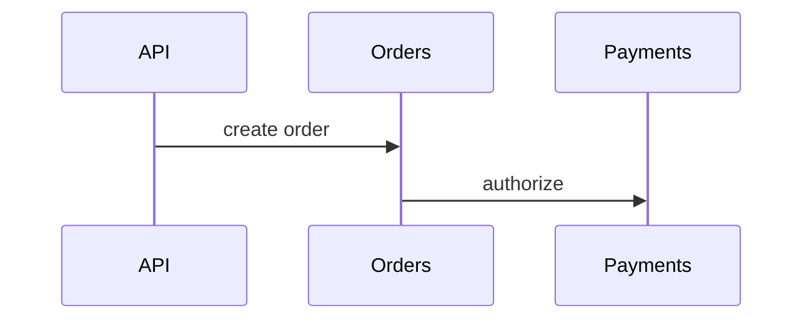

# Distributed Tracing

## Why it matters
Tracing shows how a request flows through multiple services.

## Progression checkpoints
| Level | Focus |
| --- | --- |
| Beginner | Understand spans and traces. |
| Intermediate | Propagate trace headers. |
| Senior | Use tracing to find bottlenecks. |
| Principal | Standardize tracing across services. |

## Key concepts
- Trace IDs and span IDs.
- Sampling strategies.
- Trace context propagation.

## Real-world example: Checkout flow
Traces show that payment authorization dominates total latency.

## Diagram

## Practical checklist
- Propagate trace headers across all hops.
- Sample intelligently to manage cost.
- Correlate traces with logs.
