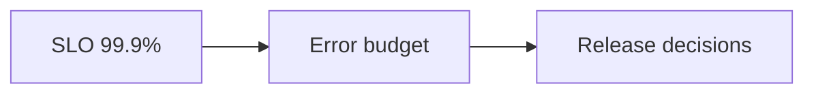

# SLIs and SLOs

## Why it matters
SLIs and SLOs translate user expectations into measurable targets.

## Progression checkpoints
| Level | Focus |
| --- | --- |
| Beginner | Define latency and availability SLIs. |
| Intermediate | Set SLO targets and error budgets. |
| Senior | Use SLOs to drive priorities. |
| Principal | Define org-wide SLO standards. |

## Key concepts
- SLIs (metrics) vs SLOs (targets).
- Error budgets and burn rate.
- Availability and latency objectives.

## Real-world example: Search API SLO
Search must succeed 99.9% of the time with p95 latency under 200 ms.

## Diagram

## Practical checklist
- Align SLOs with user impact.
- Track error budget burn rate.
- Pause risky releases when budgets are exhausted.
