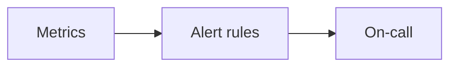

# Alerting Strategy

## Why it matters
Alerting should notify humans only when action is required.

## Progression checkpoints
| Level | Focus |
| --- | --- |
| Beginner | Create basic alerts. |
| Intermediate | Reduce noise with thresholds and dedupe. |
| Senior | Use multi-window burn rates. |
| Principal | Define alerting standards. |

## Key concepts
- Alert thresholds and severity.
- Burn rate alerting for SLOs.
- Deduplication and suppression.

## Real-world example: Latency alerting
Alerts trigger when p99 latency breaches SLO for two consecutive windows.

## Diagram

## Practical checklist
- Alert only on actionable conditions.
- Route alerts by ownership.
- Review alerts monthly for noise.
