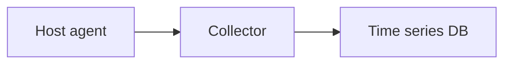

# Agents and Exporters

## Why it matters
Agents and exporters collect system and application metrics consistently.

## Progression checkpoints
| Level | Focus |
| --- | --- |
| Beginner | Understand agent roles. |
| Intermediate | Configure exporters. |
| Senior | Standardize collection across hosts. |
| Principal | Define observability platform architecture. |

## Key concepts
- Host agents and sidecars.
- Exporters for metrics and logs.
- Collection intervals and overhead.

## Real-world example: Node metrics
Node exporters collect CPU, memory, and disk metrics from all servers.

## Diagram

## Practical checklist
- Standardize exporters across services.
- Limit high-cardinality metrics.
- Monitor agent health and lag.
