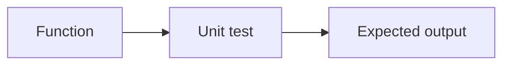

# Unit Testing

## Why it matters
Unit tests validate logic quickly and catch regressions early.

## Progression checkpoints
| Level | Focus |
| --- | --- |
| Beginner | Write basic unit tests. |
| Intermediate | Test edge cases and errors. |
| Senior | Keep tests fast and deterministic. |
| Principal | Define unit testing standards. |

## Key concepts
- Arrange, act, assert.
- Test isolation and determinism.
- Edge cases and error handling.

## Real-world example: Price calculator
Unit tests validate discount and tax logic without external dependencies.

## Diagram

## Practical checklist
- Keep unit tests fast.
- Avoid network and database calls.
- Cover edge cases and error paths.
