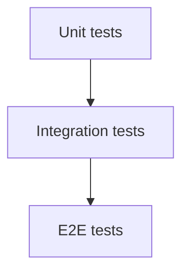

# Integration and End-to-End Testing

## Why it matters
Integration tests validate interactions; E2E tests confirm real workflows.

## Progression checkpoints
| Level | Focus |
| --- | --- |
| Beginner | Run integration tests for core services. |
| Intermediate | Use E2E tests for critical paths. |
| Senior | Balance coverage and runtime cost. |
| Principal | Define test scope and budgets. |

## Key concepts
- Integration tests for service dependencies.
- End-to-end tests for user flows.
- Test pyramid and coverage balance.

## Real-world example: Checkout flow
An E2E test verifies cart, payment, and confirmation.

## Diagram

## Practical checklist
- Keep E2E tests focused on critical paths.
- Run integration tests in CI.
- Use stable test environments.
