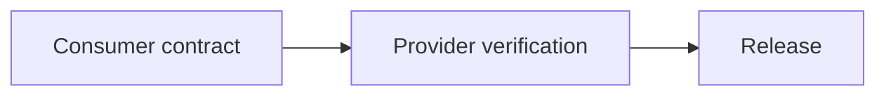

# Contract Testing

## Why it matters
Contracts prevent breaking changes between services and clients.

## Progression checkpoints
| Level | Focus |
| --- | --- |
| Beginner | Understand API contracts. |
| Intermediate | Use consumer-driven contracts. |
| Senior | Automate contract checks in CI. |
| Principal | Require contract testing for shared APIs. |

## Key concepts
- Consumer-driven contracts.
- Provider verification.
- Compatibility checks.

## Real-world example: Billing API
The billing service validates contracts for all client apps before release.

## Diagram

## Practical checklist
- Keep contracts versioned and reviewed.
- Fail builds on contract violations.
- Coordinate releases across teams.
