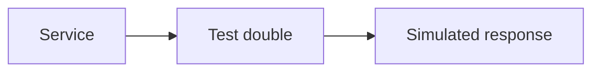

# Test Doubles

## Why it matters
Test doubles isolate units and make tests faster and more reliable.

## Progression checkpoints
| Level | Focus |
| --- | --- |
| Beginner | Use mocks and stubs. |
| Intermediate | Use fakes for behavior. |
| Senior | Avoid over-mocking. |
| Principal | Define guidelines for doubles. |

## Key concepts
- Mock, stub, fake, and spy.
- When to mock vs use real dependencies.
- Contract vs behavior testing.

## Real-world example: Payment provider mock
The service uses a fake gateway to simulate payment responses in tests.

## Diagram

## Practical checklist
- Prefer fakes over complex mocks.
- Avoid mocking the system under test.
- Keep doubles aligned with real contracts.
