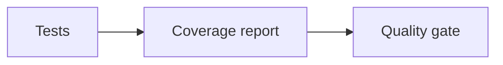

# Coverage and Mutation Testing

## Why it matters
Coverage highlights gaps; mutation testing reveals weak assertions.

## Progression checkpoints
| Level | Focus |
| --- | --- |
| Beginner | Track line coverage. |
| Intermediate | Set coverage thresholds. |
| Senior | Use mutation testing for critical code. |
| Principal | Define coverage standards by risk. |

## Key concepts
- Line, branch, and path coverage.
- Mutation testing basics.
- Risk-based coverage targets.

## Real-world example: Checkout coverage
Checkout code requires 90% branch coverage and mutation score targets.

## Diagram

## Practical checklist
- Focus coverage on critical paths.
- Avoid chasing coverage for its own sake.
- Use mutation testing for core logic.
