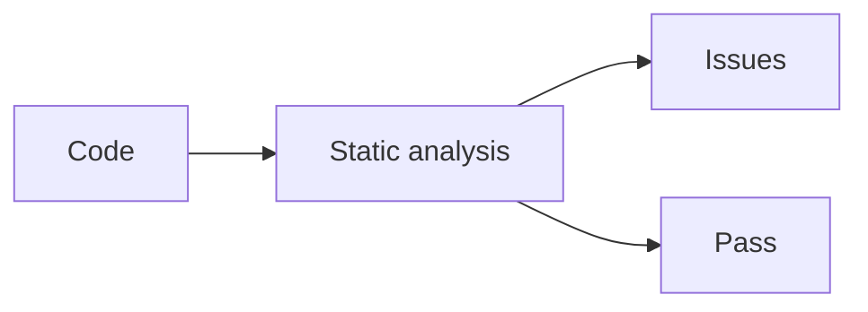

# Static Analysis and Linting

## Why it matters
Static analysis catches defects and enforces style before runtime.

## Progression checkpoints
| Level | Focus |
| --- | --- |
| Beginner | Use linters locally. |
| Intermediate | Add linters to CI. |
| Senior | Customize rules for the codebase. |
| Principal | Define org-wide linting standards. |

## Key concepts
- Linters and formatting tools.
- Static analysis and security checks.
- False positives and rule tuning.

## Real-world example: Lint gate
PRs fail if lint checks report errors or unsafe patterns.

## Diagram

## Practical checklist
- Enforce formatting consistently.
- Tune rules to avoid noise.
- Include security analyzers in CI.
