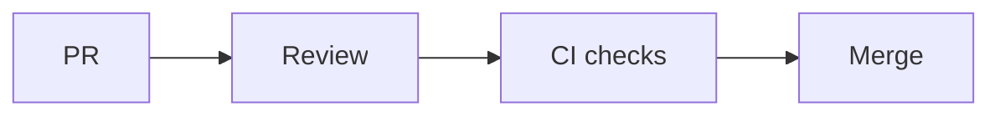

# Code Review and Quality Gates

## Why it matters
Reviews and gates prevent defects from reaching production.

## Progression checkpoints
| Level | Focus |
| --- | --- |
| Beginner | Follow review checklists. |
| Intermediate | Give actionable feedback. |
| Senior | Enforce quality gates and standards. |
| Principal | Define review culture and policies. |

## Key concepts
- Review checklists and standards.
- Required CI checks.
- Risk-based approvals.

## Real-world example: High-risk change
A payments change requires two approvals and passing security checks.

## Diagram

## Practical checklist
- Keep PRs small and focused.
- Require approvals for critical services.
- Track review latency and quality.
