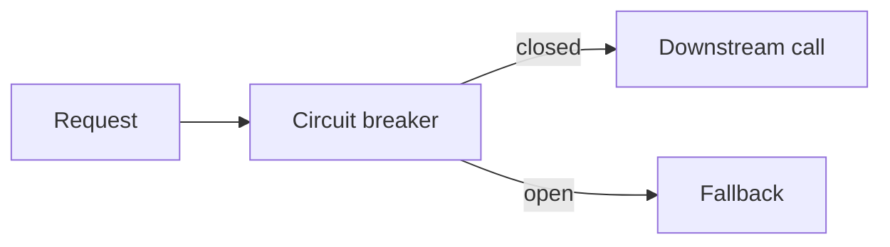

# Resilience Patterns

## Why it matters
Resilience patterns prevent cascading failures and improve stability.

## Progression checkpoints
| Level | Focus |
| --- | --- |
| Beginner | Understand retries and timeouts. |
| Intermediate | Use circuit breakers and bulkheads. |
| Senior | Apply fallback strategies. |
| Principal | Standardize resilience across services. |

## Key concepts
- Circuit breakers and bulkheads.
- Retries with backoff.
- Timeouts and fallbacks.

## Real-world example: Downstream outage
The API trips a circuit breaker and serves cached data while the dependency
recovers.

## Diagram

## Practical checklist
- Set sensible timeout and retry budgets.
- Use bulkheads to isolate failures.
- Validate fallback behavior regularly.
