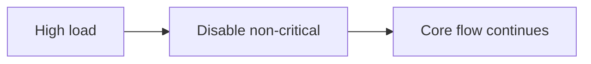

# Graceful Degradation

## Why it matters
When systems are overloaded, degrading non-critical features preserves core
functionality.

## Progression checkpoints
| Level | Focus |
| --- | --- |
| Beginner | Identify critical vs optional features. |
| Intermediate | Implement fallbacks and feature flags. |
| Senior | Use load shedding and prioritization. |
| Principal | Define degradation policies and playbooks. |

## Key concepts
- Feature flags and kill switches.
- Load shedding and priority tiers.
- Read-only or cached modes.

## Real-world example: Recommendations off
During peak load, recommendations are disabled to preserve checkout speed.

## Diagram

## Practical checklist
- Define critical paths per service.
- Test degradation modes regularly.
- Automate switches based on metrics.
