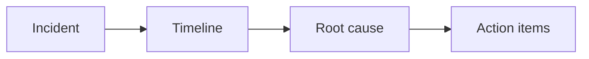

# Postmortems and RCA

## Why it matters
Postmortems turn incidents into learning and prevention.

## Progression checkpoints
| Level | Focus |
| --- | --- |
| Beginner | Document incident timelines. |
| Intermediate | Identify root causes. |
| Senior | Define corrective actions. |
| Principal | Build a blameless culture. |

## Key concepts
- Root cause analysis (RCA).
- Contributing factors and systemic issues.
- Corrective and preventive actions (CAPA).

## Real-world example: Cache outage
A cache eviction bug caused high DB load. Postmortem adds load tests and
monitoring for eviction rates.

## Diagram

## Practical checklist
- Focus on systems, not individuals.
- Assign owners and deadlines for actions.
- Track follow-up to completion.
