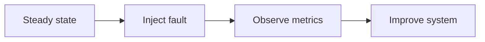

# Chaos Engineering

## Why it matters
Chaos testing reveals weaknesses before real outages occur.

## Progression checkpoints
| Level | Focus |
| --- | --- |
| Beginner | Understand chaos principles. |
| Intermediate | Run safe experiments in staging. |
| Senior | Automate experiments in production. |
| Principal | Define chaos engineering policies. |

## Key concepts
- Hypothesis-driven experiments.
- Fault injection (latency, errors).
- Blast radius control.

## Real-world example: Latency injection
The team injects 200 ms latency to a dependency to test fallbacks.

## Diagram

## Practical checklist
- Start with low-risk experiments.
- Define rollback triggers.
- Measure impact on SLOs.
