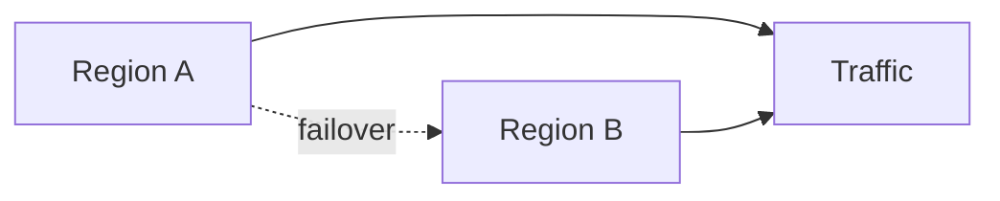

# High Availability and DR

## Why it matters
High availability and disaster recovery keep critical systems running during
failures.

## Progression checkpoints
| Level | Focus |
| --- | --- |
| Beginner | Understand redundancy and failover. |
| Intermediate | Use active-passive setups. |
| Senior | Design active-active architectures. |
| Principal | Define DR plans and drills. |

## Key concepts
- Redundancy and failover.
- Active-active vs active-passive.
- RPO and RTO targets.

## Real-world example: Multi-region failover
A service runs in two regions; traffic shifts on health check failure.

## Diagram

## Practical checklist
- Define RPO and RTO targets.
- Test failover regularly.
- Automate traffic shifting where possible.
