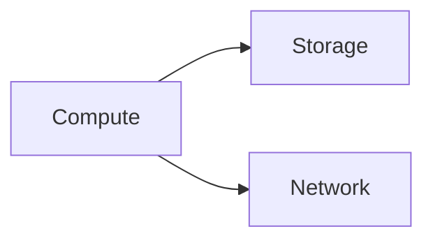

# Cloud Primitives

## Why it matters
Cloud primitives define the building blocks of any deployment architecture.

## Progression checkpoints
| Level | Focus |
| --- | --- |
| Beginner | Understand compute, storage, and networking. |
| Intermediate | Choose the right primitive per workload. |
| Senior | Optimize for cost and reliability. |
| Principal | Standardize reference architectures. |

## Key concepts
- Compute: VMs, containers, serverless.
- Storage: block, object, file.
- Networking: VPCs, subnets, routing.

## Real-world example: Media service
Object storage hosts images, while compute handles resizing jobs.

## Diagram

## Practical checklist
- Use object storage for large static assets.
- Isolate networks with private subnets.
- Align primitives with performance needs.
