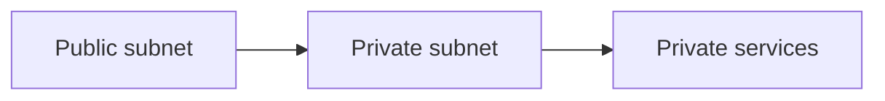

# IAM and Network Security

## Why it matters
IAM and network controls protect cloud resources from unauthorized access.

## Progression checkpoints
| Level | Focus |
| --- | --- |
| Beginner | Understand IAM roles and policies. |
| Intermediate | Use security groups and network ACLs. |
| Senior | Apply least privilege and segmentation. |
| Principal | Define cloud security baselines. |

## Key concepts
- IAM roles, policies, and service accounts.
- Security groups and firewall rules.
- Network segmentation and private subnets.

## Real-world example: Private services
Internal services run in private subnets with strict inbound rules.

## Diagram

## Practical checklist
- Use least privilege for every role.
- Deny public access by default.
- Review IAM policies regularly.
